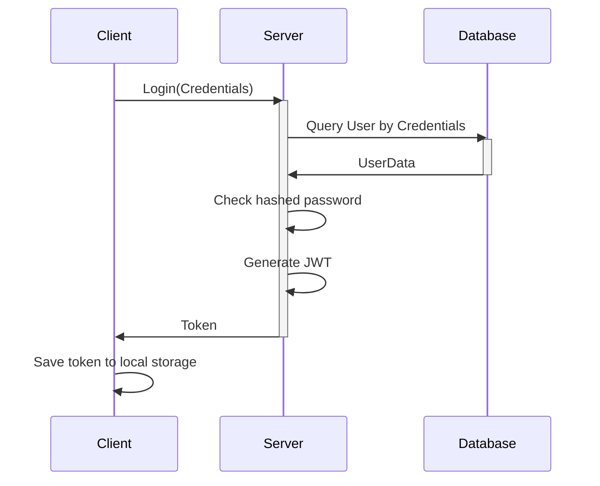
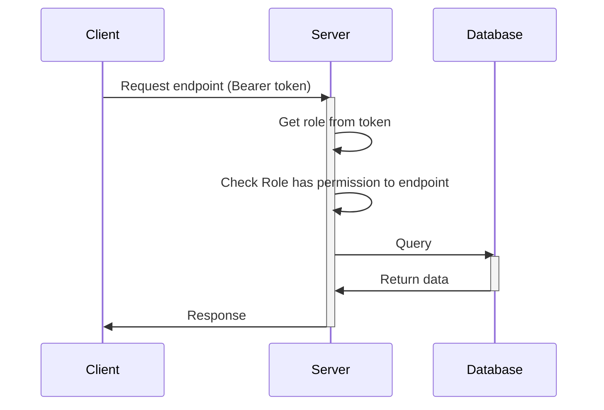

# Section 3: Authentication and Authorization

## Sequence Diagram

I use mermaid to draw the sequence diagram.

The following sequence diagram shows the interaction between the user, server, and database when a user login.

This is simple flow that i use in my project.
I use JWT for authentication and use role data in jwt to authorize.

### Authentication

## Authorization

## Strong and Weak points

This is simple flow: Only use JWT for authentication and use role data in jwt to authorize, it is easy to use and understand and implement.

- Strong points:
    - JWT is easy to use.
    - JWT is fast.
    - JWT maybe secure.
    - This flow is easy to understand and implement with Spring Security.
- Weak points:
    - JWT is not suitable for large data, too many roles will make the token too large.
    - JWT maybe not secure, if the secret key is leaked, the token will be compromised.
    - JWT cannot be revoked, if the token is compromised, we cannot revoke it.
    - This flow cannot handle complex authorization like Casbin.

- Improvement solutions: 
    - Use refresh token to solve the problem of token cannot be revoked.
    - Use OAuth2 to solve the problem of too many roles will make the token too large.
    - Use an external service to manage the token, like AWS Cognito, Auth0, Keycloak.
    - Use a third-party library to authorization like Casbin.

## Implementation

I use Spring Security to implement this flow.

The code for this flow is in package [com/hnv99/hmall/common/security](https://github.com/vanhung4499/hmall/tree/main/src/main/java/com/hnv99/hmall/common/security)

I have just implemented the basic flow with Spring Security, the code is not completed yet, many modules are not apply authorization yet.
