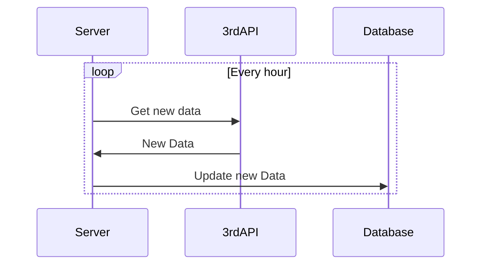

# Section 4: External Datasource

## Solution

For synchronize products, pricing of the Agency by using third-party API, I can use the following flow:

The flow is simple, every hour, the server will get new data from the third-party API, then update the database with the new data.

We can use the `@Scheduled` annotation in Spring to run the task every hour. Or we can use other scheduling tools like `Quartz` or `Spring Batch` or `XXL-Job` to run the task.

## Implementation

I have not implemented this flow in project. I don't have enough time to implement this flow.

## Strong and Weak points

This flow is simple and easy to implement. But it has some weak points:

- The third-party API may have some problems, so we need to handle the exception.
- The third-party API may have some rate limit, so we need to handle the rate limit.
- When writing new data to the database, we need to handle the concurrency problem.
- The sql database may not be the best choice for this flow, we may need to use NoSQL database like MongoDB to handle the new data.

Improvement:

- Use MongoDB to store products data, because MongoDB is more suitable for storing products data.
- Use an scheduler like `Quartz` or `Spring Batch` or `XXL-Job` to run the task, because these tools are more suitable for running the task.
- Use Master-Slave database model to handle the concurrency problem.